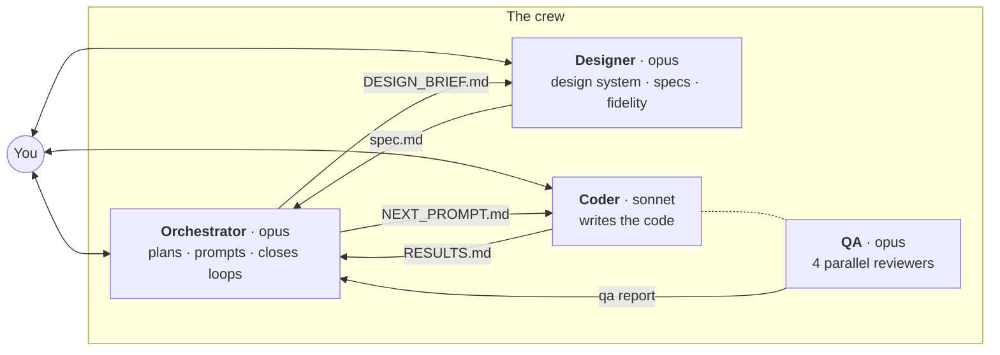
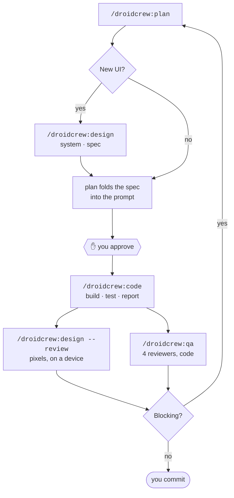

<div align="center">

# droidCrew

**A four-agent crew for native Android development in [Claude Code](https://claude.com/claude-code).**
Design → plan → implement → review, with you approving every handoff.

[](LICENSE)
[](https://code.claude.com/docs/en/plugins)
[](https://developer.android.com)
[](https://developer.android.com/compose)
[](https://m3.material.io)

</div>

---

One agent doing everything is one context holding everything — the design rationale, the
architecture, the diff, and the review, all at once, all drifting. droidCrew splits the work across
four specialists that share nothing but files in your repo, so each arrives at its job with a clean
head and a written brief.

**Only one of them can write code.** The rest have to convince it.



## Why it is shaped this way

| Rule | Why |
|---|---|
| **One writer** | Only the Coder touches `src/`. Everyone else proposes. A `PreToolUse` hook enforces it. |
| **One funnel** | The Coder reads exactly one document. The design spec is folded *inline* into the prompt, so there is never a second source of truth. |
| **Handoffs are files, not chat** | Specs, plans and reports live in your repo, survive `/compact`, and get committed alongside the code they describe. |
| **Every gate is yours** | Nothing is written before you approve the plan. No agent commits, pushes, or branches unless you ask in that session. |
| **Reviews are independent** | Four reviewers see the same diff cold, with no cross-talk, then one lead merges and resolves conflicts by evidence rather than by majority. |

## Quick start

```bash
# from inside your Android project
/plugin marketplace add ccspart2/droidCrew
/plugin install droidcrew@droidcrew
```

Then:

```
/droidcrew:setup     # once per project
/droidcrew:plan      # bring it a feature
```

Setup checks your Claude Design MCP, discovers the Android skills you already have installed and
routes them to the agents that need them, detects your stack from Gradle, lets you choose models and
a backlog source, and scaffolds `docs/droidcrew/`.

## The loop



Design review and QA answer different questions, and neither substitutes for the other: **QA reads
code and cannot see that the spacing is wrong; the Designer looks at pixels and cannot see a leaked
coroutine.** Run both on UI work.

A Blocking finding always returns to the Orchestrator for a correction plan — never straight to the
Coder. That is the discipline that keeps the docs and the code from drifting apart.

## Commands

| Command | What it does |
|---|---|
| `/droidcrew:setup` | MCP check, skill discovery and routing, project profile, model/backlog/designer choices, scaffold. `--skills` and `--mcp` re-run a single step. |
| `/droidcrew:plan` | Talk to the Orchestrator — triage the inbox, plan an item, write a design brief, close the loop on results and QA. |
| `/droidcrew:design` | Talk to the Designer — design system, screens, specs. `--review <item>` runs a fidelity review on a real device. |
| `/droidcrew:code` | Hand the approved prompt to the Coder, or refine an implementation with it. |
| `/droidcrew:qa` | Run the QA gate on the current diff. |
| `/droidcrew:status` | Where the pipeline is, what is pending, what to run next. |

## The crew

<table>
<tr><td width="24%" valign="top">

### 🧭 Orchestrator
`opus`

</td><td valign="top">

Your standing technical partner. Plans items, routes design work, writes the single prompt the Coder
executes, and reads results and QA reports to close the loop. Owns `PRODUCT.md`, the backlog and
`STATUS.md`. **Never writes application code** — not even a one-line Gradle fix.

</td></tr>
<tr><td valign="top">

### 🎨 Designer
`opus`

</td><td valign="top">

Owns `DESIGN.md`, authored in Material 3 **role vocabulary** from the first token — every colour a
role, every text style one of the 15 type roles in `sp`, light and dark specified together. Designs
screens in Claude Design before they are built, writes specs complete enough that the Coder never
invents a visual decision, and reviews built UI on a device against the spec it wrote.

</td></tr>
<tr><td valign="top">

### ⌨️ Coder
`sonnet`

</td><td valign="top">

The only agent authorised to write application code. Implements exactly what the prompt says, with
hard scope discipline — no adjacent refactors, no extra tests, no TODOs. Builds, runs tests, reads
counts from the XML, and records every deviation. **A missing design decision is a blocker, not an
ambiguity**: it stops rather than inventing one.

</td></tr>
<tr><td valign="top">

### 🔍 QA
`opus`

</td><td valign="top">

Dispatches four reviewers in parallel over the same diff, blind to each other — correctness,
adversarial bug hunt, code quality, and conventions/tokens/accessibility/tests. Merges and
de-duplicates, verifies every Blocking finding itself before publishing, re-runs the suite to expose
tests that cannot fail, and writes manual QA scenarios for what no test can check.
**Reports; never fixes.**

</td></tr>
</table>

## What lands in your repo

```
docs/droidcrew/
├── PRODUCT.md            # promise, objects, Non-negotiables ← merge-blocking for every agent
├── DESIGN.md             # the design system + a decision log
├── BACKLOG.md            # items, acceptance criteria, an inbox that gets triaged
├── STATUS.md             # where the pipeline is
├── config.json           # models, designer mode, backlog source, guard
├── skills.md             # which skills each agent reads, and when
├── profile.md            # detected stack, build commands, verified test baseline
├── design/<item>/spec.md # screen specs — committed, current-truth only
├── plans/<item>.md       # approved plans
├── qa/<item>.md          # findings, verdict, manual scenarios
│
├── DESIGN_BRIEF.md       # ┐
├── NEXT_PROMPT.md        # ├ transient handoffs, gitignored by setup
└── RESULTS.md            # ┘
```

Committed artifacts are the permanent record; the three handoff files are scratch, overwritten every
cycle. Specs are kept **history-free** — supersessions go to `DESIGN.md`'s decision log, so a spec
never decays into a changelog nobody can read.

## Skills

**droidCrew ships no Android skills of its own.** It routes the ones you already have — from
`.claude/skills/`, `~/.claude/skills/`, and any installed plugin — into three tiers:

| Tier | Meaning |
|---|---|
| **Always** | Read in full every session. Capped at three per agent, and a skill only qualifies if you *cannot* name an item where reading it would change nothing. |
| **On demand** | Read only when a stated trigger fires — "when the work introduces suspending code", "when the diff contains Composables". |
| **Not routed** | Discovered but irrelevant here, with the reason recorded so a re-run does not re-propose it. |

The Orchestrator names which on-demand skills each cycle needs, in the plan and in the prompt, so the
Coder never has to guess. Pairs well with
[rcosteira79/android-skills](https://github.com/rcosteira79/android-skills).

> [!NOTE]
> Tiering controls what agents **read in full**. An installed skill's description is loaded every
> session regardless of routing — that cost is paid at install time, and no routing removes it.

## Guardrails

**Write guard.** A `PreToolUse` hook blocks edits to application source unless the active stage is
`code`. Docs stay writable. Disable with `"guard": { "enabled": false }` in `config.json`.

> [!IMPORTANT]
> The guard is a backstop against slips, **not a sandbox**. The stage file lives under `docs/`, so
> the Orchestrator can open it — which it must, in order to drive the Coder as a subagent. What
> keeps the other agents out of your source is their instructions; the guard catches accidents.
> `/droidcrew:status` warns when an interrupted cycle has left a stage open.

**Git is yours.** No agent commits, pushes, or creates branches unless you ask in that session.
Agents leave the tree dirty and describe what changed.

## Requirements

| | |
|---|---|
| **Required** | Claude Code · an Android project with a Gradle wrapper · a JDK |
| **Recommended** | A `CLAUDE.md` holding your conventions — every agent treats it as the top authority |
| **Optional** | `adb` and a device or emulator, for device checks and fidelity reviews |
| **Optional** | The Claude Design MCP — without it the Designer works in spec-only mode |

## Configuration

Everything lives in `docs/droidcrew/config.json` and can be changed at any time:

```json
{
  "models":   { "orchestrator": "opus", "designer": "opus", "coder": "sonnet", "qa": "opus" },
  "designer": { "mode": "operate" },
  "backlog":  { "source": "file", "itemPrefix": "DC" },
  "guard":    { "enabled": true }
}
```

`designer.mode` is `operate` (the Designer drives Claude Design) or `guide` (you drive, it teaches
one step at a time). `backlog.source` is `file` or `github`. QA runs on a stronger model than the
Coder deliberately — reviewing on the same tier as the writer defeats the gate.

## Contributing

Issues and pull requests are welcome. [`docs/TEST-PLAN.md`](docs/TEST-PLAN.md) is a coverage-driven
plan for exercising every surface of the plugin against a throwaway app — it records which
behaviours are verified and which are still theory, so you can see what to re-check after changing
an agent. [`CHANGELOG.md`](CHANGELOG.md) tracks releases.

## License

[MIT](LICENSE)
